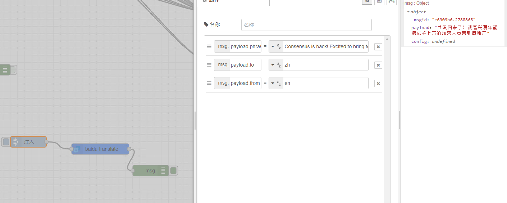
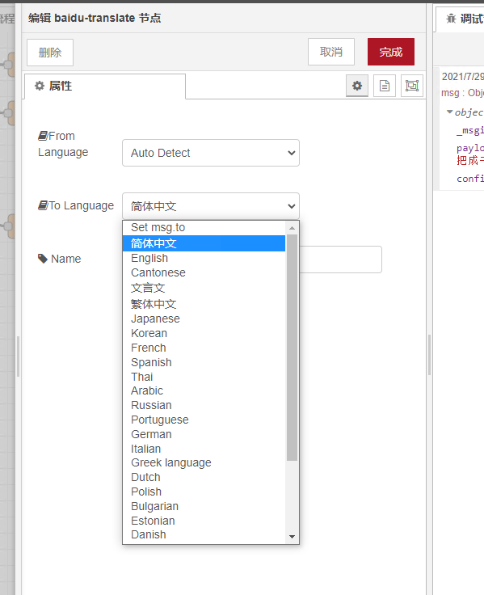

# node-red-contrib-baidu-translate
Node-RED node for Baidu Translate
百度翻译 for Node-RED

Now you can choose the language using the payload!

Based on <a href="https://www.npmjs.com/package/node-red-contrib-baidu-translate">This package    </a>

Install
-------
Run the following command in your Node-RED user directory - typically `~/.node-red`

        npm install node-red-contrib-baidu-translate

Example
-------
String data in msg.payload will be translated into language specified in node property.

More than 100 languages are supported in the Baidu Translate node.

Usage
-------
Translate from German to English. This will result poision.

msg.payload.to = 'en'; 
msg.payload.from = 'zh'; 
msg.payload.phrase = 'English'; 

Language codes
--------------
abbr | name
---|---
auto | Automatic detection
zh | Chinese
en | English
yue	| Cantonese
wyw	| Classical Chinese
jp	| Japanese
kor	| Korean
fra	| French
spa	| Spanish
th	| Thai
ara	| Arabic
ru	| Russian
pt	| Portuguese
de	| German
it	| Italian
el	| Greek language
nl	| Dutch
pl	| Polish
bul	| Bulgarian
est	| Estonian
dan	| Danish
fin	| Finnish
cs	| Czech
rom	| Romanian
slo	| Slovenia
swe	| Swedish
hu	| Hungarian
cht	| Traditional Chinese
vie	| Vietnamese